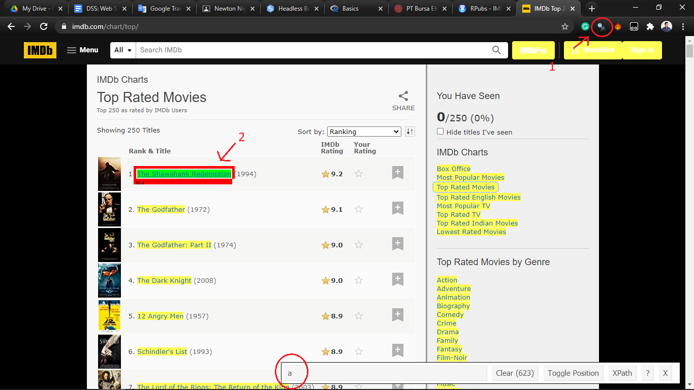
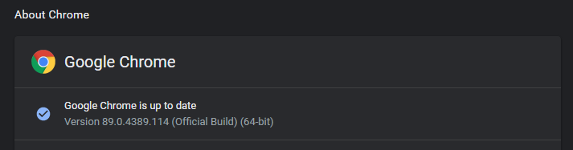

```{r setup, include=FALSE}
# clean up the environment
#rm(list = ls())
# setup chunk options
knitr::opts_chunk$set(
  message = FALSE,
  warning = FALSE,
  fig.align = "center",
  comment = "#>"
)
options(scipen = 9999)

```

# Preface {.tabset}

## Introduction

- what is web scraping?
- why we do web scraping?


## Training objectives

This is the first online data science series course of _Static and Dynamic Web Scraping in R_. The primary objective of this course is to provide a participant a comprehensive introduction about tools and software for web scraping using the popular open-source tools: R. The material will covers:

**Introductory Module:**

* **Tools Introduction**  
  + R and R Studio  
  + Open source packages  
  + Using R Markdown  
  + R Programming Basics  
* **Data Wrangling with R's `tidyverse`**  
  + Working with tabular data in R: Tips and Techniques 
  + Data Wrangling using `dplyr`
  + Introduction to `stringr` and `stringi` for text manipulation
  
***
**Main Module:**

* **Legality of Web Scraping** 
  + Website terms and condition
  + robots.txt as regulation of the website about web crawling
* **How web scraping work in general**
  + Intro to HTML and CSS
  + Web scraping workflow
* **Scraping data from non java-scripted website using rvest**
  + Hands-on web scraping using `rvest`
  + Using css selector
  + Build looping code for multiple pages
* **Scraping data from java-scripted website and building browser bot using rselenium**
  + Hands-on web scraping using `Rselenium`
  + The difference between `Rselenium` and `rvest` ability
  + The interactive of `Rselenium`
  + Build looping code for multiple pages and input
* **Exploratory Data Analysis** 
  + Wrangling Scraped data
  + Exporting data
  + Optional : Example of a project using web scraping capabilities to deliver insightful knowledge


## Library and setup

In this **Library and Setup** section you’ll see some code to initialize our workspace, and the packages we’ll be using for this introductory session of this workshop. 

_Packages_ are collections of R functions, data, and compiled code in a well-defined format. The directory where packages are stored is called the _library_. R comes with a standard set of packages. Others are available for download and installation. Once installed, they have to be loaded into the session to be used. 

You will need to use `install.packages()` to install any packages that are not yet downloaded onto your machine. To install packages, type the command below on your console then press ENTER.

```{r eval=FALSE}
## DO NOT RUN CHUNK
# packages <- c("dplyr", "rvest")
# 
# install.packages(packages)
```

Then you need to load the package into your workspace using the `library()` function. Special for this course, the _rmarkdown_ packages do not need to be called using `library()`.

```{r}
# package for data wrangling
library(dplyr)
library(purrr)

# package for string manipulation
library(stringr)

# package for web scraping
library(rvest)
library(RSelenium)
library(httr)

# package for data exploratory
library(ggplot2)
```


# Legality of web scraping

# Web Scraping

- How web scraping works 
- Interactive web scraping
- Web scraping workflow


# Rvest

objective: scrap information from 250 top rated film in imdb.com

## Using css selector

Web scraping is easier to do with proper tools. Web scraping is basically match specific html/css attributes from a website and gather whatever you want from it. the ‘matching’ step is kinda difficult to do if you just saw it from the page source. So i recommend you to use Google Chrome browser with SelectorGadget extension (surely you can use another web browser). You can download and install SelectorGadget extension [here](https://chrome.google.com/webstore/detail/selectorgadget/mhjhnkcfbdhnjickkkdbjoemdmbfginb?hl=en) (for google chrome)

```{r}

```

CSS Selector extract css address from selected elements. Selected elements will be highlighted with green, yellow is web element that has a same address as green. It means if you gather information by that address, all information from selected area will be gathered too. If you want to reduce the selected area, you can exclude it by click the non-desired elements. The non-desired element will highlighted by red color.


## scrap list of links

```{r}
list_link <- "https://www.imdb.com/chart/top/"

page_list <- read_html(list_link)

movie_link <- html_nodes(page_list, css = ".titleColumn a") %>% 
  html_attr("href")

movie_link <- data.frame(movie_link) %>% 
  mutate(link = paste("https://www.imdb.com",movie_link,sep = ""))

head(movie_link)
```

## gathering information

We've finished gathering all 250 top rated movie link in imdb. Next, lets try to gather information from every link. We will scrap movie title, genre, release date, rating, director, writers, casts, budget,runtime, language, and worldwide gross

First lets save the main html in an object
```{r}
movie_1 <- read_html(movie_link$link[1])
```

### title
movie title
```{r}
title <- html_node(movie_1,css = "h1") %>% 
  html_text2()
title
```

<!-- we get the title but it contains unnecessary whitespace. It will happen a lot so to make our job easier, lets build custom function to clean the result. -->
<!-- ```{r} -->
<!-- cleaner <- function(x){ -->
<!--   x <- x %>%  -->
<!--     # delete extra space between word -->
<!--     str_squish() %>%  -->
<!--     # delete extra space after and before sentence -->
<!--     str_trim() -->
<!--   return(x) -->
<!-- } -->
<!-- ``` -->

<!-- ```{r} -->
<!-- title <- cleaner(title) -->
<!-- title -->
<!-- ``` -->


### genre

Extracting genre is a bit tricky. It's located at "#titleStoryLine" and ".inline" nodes. The problem is its located along with other value like storyline, tagline and movie' keywords. There's no specific key to extract the genres alone

```{r}
movie_1 %>% 
  html_node(".txt-block~ .canwrap a") %>% 
  html_text()

movie_1 %>% 
  html_node("#titleStoryLine") %>% 
  html_nodes(".inline") %>% 
  html_text2()
```

So we need another way to extract it. We will convert the value to dataframe and rely on string manipulation. Its painful but we need to do it.

```{r}
movie_1 %>% 
  html_node("#titleStoryLine") %>% 
  html_nodes(".inline") %>% 
  html_text2() %>% 
  as.data.frame() %>% 
  setNames("genre") %>% 
  filter(str_detect(genre,"Genres:\n")) %>% 
  mutate(clean = str_replace_all(genre,"Genres:\n",""))
```

Some movie are tagged with more than one genre. "The Godfather (1972)"  for example, it has crime and drama genres. In this case we need more step to clean it

```{r}
movie_2 <- read_html(movie_link$link[2])

movie_2 %>% 
  html_node("#titleStoryLine") %>% 
  html_nodes(".inline") %>% 
  html_text(trim = T) %>% 
  as.data.frame() %>% 
  setNames("genre") %>% 
  filter(str_detect(genre,"Genres:\n")) %>% 
  mutate(clean = str_replace_all(genre,"Genres:|\n",""))

```

Let's let the "|" as the separator. We will use this pattern because its also safe for single genre

```{r}
movie_1 %>% 
  html_node("#titleStoryLine") %>% 
  html_nodes(".inline") %>% 
  html_text(trim = T) %>% 
  as.data.frame() %>% 
  setNames("genre") %>% 
  filter(str_detect(genre,"Genres:\n")) %>% 
  mutate(clean = str_replace_all(genre,"Genres:|\n",""))

```

### release date

Release date location is also tricky like genre does, but its located on different node. We also need string manipulation function to extract it
```{r}
movie_1 %>% 
  html_node("#titleDetails") %>% 
  html_nodes(".txt-block") %>% 
  html_text2() %>% 
  as.data.frame() %>% 
  setNames("release_date") %>% 
  filter(str_detect(release_date,"Release Date:")) 
```

The release date is located between "Release Date:" and "(" text. We will use function from qdapregex package to extract it rather than writing a regex pattern.

```{r}
rls_date <- movie_1 %>% 
  html_node("#titleDetails") %>% 
  html_nodes(".txt-block") %>% 
  html_text(trim = T) %>% 
  as.data.frame() %>% 
  setNames("release_date") %>% 
  filter(str_detect(release_date,"Release Date:")) %>% 
  mutate(clean_date = unlist(qdapRegex::ex_between(text.var = release_date,
                                            left = "Release Date:",right = "(")))

rls_date %>% 
  select(clean_date)
```

### rating

extracting rating is easy. We only need to find the css precisely
```{r}
movie_1 %>% 
  html_node("strong span") %>% 
  html_text2()
```

### directors and writers

directors and writers are located in the same location. Its often to see the writers are written with some extra information (that quoted with bracket like this). We need to clean it carefully

```{r}
credit <- movie_1 %>% 
  html_nodes(".credit_summary_item") %>% 
  html_text(trim = T) %>% 
  as.data.frame() %>% 
  setNames("credit")
credit
```

director
```{r}
credit %>% 
  slice(1) %>% 
  mutate(director_clean = str_replace(credit,"Director:\n","")) %>% 
  pull(director_clean)
```

writers
for the writers we only need the name. We will remove every text between ( )
```{r}
credit %>% 
  slice(2) %>% 
  mutate(writer_clean = str_replace(credit, "Writers:\n","")) %>% 
  mutate(writer_clean = qdapRegex::rm_between(writer_clean, left = "(",right = ")")) %>% 
  select(writer_clean) %>% 
  pull(writer_clean)
```

we also need to be carefull here. some movies like The Matrix (1999) has more than 2 director. In that case, our previous code will not working beacuse the string pattern we put in the cleaning is different

```{r}
movie_3 <- read_html(movie_link$link[16])
credit_2 <- movie_3 %>% 
  html_nodes(".credit_summary_item") %>% 
  html_text2() %>% 
  as.data.frame() %>% 
  setNames("credit")

credit_2
```

wrong example
```{r}
credit_2 %>% 
  slice(1) %>% 
  mutate(director_clean = str_replace(credit,"Director:\n",""))

```

The pattern difference is only in "Director:" and "Directors:" but still it'll create a problem if we ignore it. We also want to remove unnecesary text in bracket ( )

```{r}
credit_2 %>% 
  slice(1) %>% 
  mutate(director_clean = str_replace(credit,"Directors:\n","")) %>% 
  mutate(director_clean = qdapRegex::rm_between(director_clean, left = "(",right = ")")) %>% 
  select(director_clean) %>% 
  pull(director_clean)
```

The problem is only in str_replace pattern. Some movies only have one writer, so in our previous code we only need to change the pattern

### casts

Gathering the class is surprisingly easy. We only need to find the precise css and extract the text. 

```{r}
casts <- movie_1 %>% 
  html_nodes(".primary_photo+ td") %>% 
  html_text(trim = T) %>% 
  as.data.frame() %>% 
  setNames("Casts")
casts
```

for addition, let's say we need the hyperlink that linked in every casts. To extract the link (not the text) we need extra function to gather information based on its html attribute, just like what we do when we gather the movie links

```{r}
link_casts <- movie_1 %>% 
  html_nodes(".primary_photo+ td a") %>% 
  html_attr("href") %>% 
  as.data.frame() %>% 
  setNames("casts_link") %>% 
  mutate(casts_link = paste("https://www.imdb.com",casts_link,sep = ""))

link_casts
```

### budget

```{r}
budget <- movie_1 %>% 
  html_node("#titleDetails") %>% 
  html_nodes(".txt-block") %>% 
  html_text(trim = T) %>% 
  as.data.frame() %>% 
  setNames("budget") %>% 
  filter(str_detect(budget,"Budget:")) %>% 
  mutate(budget = str_replace_all(budget,",","")) %>% 
  mutate(budget = as.numeric(str_extract(budget,"[[:digit:]]+")))

budget
```


### runtime

```{r}
runtime <- movie_1 %>% 
  html_node("#titleDetails") %>% 
  html_nodes(".txt-block") %>% 
  html_text(trim = T) %>% 
  as.data.frame() %>% 
  setNames("runtime") %>% 
  filter(str_detect(runtime,"Runtime:")) %>% 
  mutate(runtime = as.numeric(str_extract(runtime,"[[:digit:]]+")))

runtime
```

### language
```{r}
language <- movie_1 %>% 
  html_node("#titleDetails") %>% 
  html_nodes(".txt-block") %>% 
  html_text(trim = T) %>% 
  as.data.frame() %>% 
  setNames("language") %>% 
  filter(str_detect(language,"Language:")) %>% 
  mutate(language = str_replace(language,"Language:\n",""))

language
```


### gross
```{r}
ww_gross <- movie_1 %>% 
  html_node("#titleDetails") %>% 
  html_nodes(".txt-block") %>% 
  html_text(trim = T) %>% 
  as.data.frame() %>% 
  setNames("ww_gross") %>% 
  filter(str_detect(ww_gross,"Cumulative Worldwide Gross:")) %>% 
  mutate(ww_gross = str_replace_all(ww_gross,",","")) %>% 
  mutate(ww_gross = as.numeric(str_extract(ww_gross,"[[:digit:]]+")))
  
ww_gross
```


## Assemble

Now we've successfully gather all information. In order to make it automatic, we need to build loop function to visit all 250 movie' link. But before that, we also need to build custom function to gather the information in one go.

```{r}
info_gather <- function(url){
  
  read <- read_html(url)
  
  # extract title
  title <- html_node(read,css = "h1") %>% 
    html_text2()
  
  # extract genre
  genres <- read %>% 
    html_node("#titleStoryLine") %>% 
    html_nodes(".inline") %>% 
    html_text2() %>% 
    as.data.frame() %>% 
    setNames("genre") %>% 
    filter(str_detect(genre,"Genres:\n")) %>% 
    mutate(clean = str_replace_all(genre,"Genres:|\n","")) %>% 
    pull(clean)
  
  # rating
  rating <- read %>% 
    html_node("strong span") %>% 
    html_text()
  
  # extract credit that contain directors and writers
  credit <- read %>% 
    html_nodes(".credit_summary_item") %>% 
    html_text2() %>% 
    as.data.frame() %>% 
    setNames("credit") %>% 
    mutate(credit = str_replace_all(credit,"\n"," "))
  
  # extract director
  if(str_detect(credit$credit[1],"Director:")){
    director <- credit %>% 
      slice(1) %>% 
      mutate(director_clean = str_replace(credit,"Director:","")) %>% 
      mutate(director_clean = qdapRegex::rm_between(director_clean, left = "(",right = ")")) %>% 
      pull(director_clean)
  }else{
    director <- credit %>% 
      slice(1) %>% 
      mutate(director_clean = str_replace(credit,"Directors:","")) %>% 
      mutate(director_clean = qdapRegex::rm_between(director_clean, left = "(",right = ")")) %>% 
      select(director_clean) %>% 
      pull(director_clean)
  }
  
  # extract writer
  if(str_detect(credit$credit[2],"Writer:")){
    writer <- credit %>% 
      slice(2) %>% 
      mutate(writer_clean = str_replace(credit, "Writer:","")) %>% 
      mutate(writer_clean = qdapRegex::rm_between(writer_clean, left = "(",right = ")")) %>% 
      select(writer_clean) %>% 
      pull(writer_clean)
  }else{
    writer <- credit %>% 
      slice(2) %>% 
      mutate(writer_clean = str_replace(credit, "Writers:","")) %>% 
      mutate(writer_clean = qdapRegex::rm_between(writer_clean, left = "(",right = ")")) %>% 
      select(writer_clean) %>% 
      pull(writer_clean)
  }
  
  # Casts
  casts <- read %>% 
    html_nodes(".primary_photo+ td") %>% 
    html_text2() %>% 
    as.data.frame() %>% 
    setNames("Casts") %>% 
    pull(Casts)
  
  # extract details block that contain various information
  details <- read %>% 
    html_node("#titleDetails") %>% 
    html_nodes(".txt-block") %>% 
    html_text(trim = T) %>% 
    as.data.frame() %>% 
    setNames("details")
  
  # extrack release date
  rls_date <- details %>% 
    filter(str_detect(details,"Release Date:")) %>% 
    mutate(clean_date = unlist(qdapRegex::ex_between(text.var = details,
                                                     left = "Release Date:",
                                                     right = "("))) %>% 
    pull(clean_date)
  
  # Budget
  if(str_detect(paste(details$details,collapse = ","),"Budget:") == FALSE){
    budget <- NA
  }else{
    budget <- details %>% 
      filter(str_detect(details,"Budget:")) %>% 
      mutate(budget = str_replace_all(details,",","")) %>% 
      mutate(budget = as.numeric(str_extract(budget,"[[:digit:]]+"))) %>% 
      pull(budget)
  }
  
  # runtime
  if(str_detect(paste(details$details,collapse = ","),"Runtime:") == FALSE){
    runtime <- NA
  }else{
    runtime <- details %>% 
      filter(str_detect(details,"Runtime:")) %>% 
      mutate(runtime = as.numeric(str_extract(details,"[[:digit:]]+"))) %>% 
      pull(runtime)
  }
  
  
  # Language
  language <- details %>% 
    filter(str_detect(details,"Language:")) %>% 
    mutate(language = str_replace(details,"Language:\n","")) %>% 
    mutate(language = str_replace_all(language,"\n"," "),
           language = str_squish(language)) %>% 
    pull(language)
  
  # gross
  if(str_detect(paste(details,collapse = ","),"Cumulative Worldwide Gross:") == FALSE){
    gross <- NA
  }else{
    gross <- details %>% 
      filter(str_detect(details,"Cumulative Worldwide Gross:")) %>% 
      mutate(ww_gross = str_replace_all(ww_gross,",","")) %>% 
      mutate(ww_gross = as.numeric(str_extract(ww_gross,"[[:digit:]]+"))) %>% 
      pull(ww_gross)
  }
  
  
  # assembling data
  movie_data <- data.frame(
    Title = title,
    Genre = genres,
    Release_date = rls_date,
    Rating = rating,
    Director = director,
    Writer = writer,
    Casts = paste(casts,collapse = ", "),
    Budget = budget,
    Runtime = runtime,
    Language = language,
    Worldwide_Gross = gross
  )
  
  return(movie_data)
  
}

```

lets test our function before applying it to all movies link

```{r}
info_gather(url = movie_link$link[1])
```

Now we have the function where url/link as the input. The link will be processed with read_html to extract it page source then every pile of codes will do its job to gather specific information. lets build a loop to apply it for every 250 movie list.

```{r}
#movie_list <- data.frame()

for(i in 1:nrow(movie_link)){
  message("Gather movie info #",i,"/",nrow(movie_link))
  
  page <- info_gather(movie_link$link[i])
  
  movie_list <- rbind(movie_list,page)
}
```

```{r}
movie_list
```


# Rselenium

## Prerequisites

Web scraping using Rselenium need web driver based on your default internet browser. It's recommended to use Google chrome since almost every web scraping tutorial using it and this browser provide lots of useful extensions for web scraping.

From the vignettes, the author of RSelenium suggest to run selenium server by using Docker container rather than standalone binary. But is kinda hard to integrate Docker in our local pc and not all device (read: potato pc) can meet docker minimum requirements. However i will provide a brief tutorial to use rselenium in docker container. In this workshop we will run RSelenium with our default local browser. In this case, we will use Chrome

We dont need to install chrome webdriver to use RSelenium because this package provide rsDriver function which will manage the binaries needed for running a Selenium Server. In a simple words, it will download and install webdriver (based on your preferences) in your R environment.

First take a look at your chrome version Settings > About Chrome

```{r}

```

I’m using Version 88.0.4324.96, Installing webdriver with same version as our default browser is recommended. But sometimes it's okay to use another version

```{r}
# install webdriver and launch it in port 4444.
rsDriver(browser = "chrome",port = 4444L,chromever = "90.0.4430.24")
```

You can run this chunk if you want to check which chrome version is availiable in Rselenium package
```{r}
binman::list_versions("chromedriver")
```

If there's a browser popped up, you're good to go. you can ignore the warning message that comes with it. Close the browser and run this chunk. We will save the driver as a 'browser remote' named rmdr.  
```{r}
# save the driver to an object
rmdr <- remoteDriver(browserName = "chrome")
# re-open the browser
rmdr$open()
```

## Navigate to main url

Objectives : scrape xlsx file of all company' financial statement for every quarter from all available years

Let's go to the url 
```{r}
main_url <- "https://idx.co.id/perusahaan-tercatat/laporan-keuangan-dan-tahunan/"
```

```{r}
rmdr$navigate(main_url)
```


idx.co.id is one example of dynamic website. Our objective is to gather download link for the financial statement from every company. The web only show us the file only if we select the company name, year, period and click "cari" button. That's lot of interactivity to gather one file. But with Rselenium, we will build automated click, choose, and scrap to gather all information we need, that actually work like a bot. 

Before gathering any information, let's learn Rselenium simple feature yet make it the best tools for scraping, clicking and writing!

## Clicking

Pointing is bassicaly put the cursor where we want. Rselenium can work by navigating css selectors, just like rvest. First we need to tell our "remote" where is our destination and click the element

```{r}
search_box <- rmdr$findElement("css",".select2-search__field")
```

Now we have search box element stored, next we can simply send the "click" action

```{r}
search_box$clickElement()
```

we can also combine the action to simpler code

```{r}
rmdr$findElement("css",".select2-search__field")$clickElement()
```

Often times we need to select a value from dropdown box like "year". In this case we need extra clicking. There're two ways to do it: first we find the css selector for the input we want to click. For example in idx web, suppose we want to select year 2019. after we `clickElement()` the year, we put to object then we re-find the `findElement()` with css selector for the value we want. Unfortunately, in idx case, there are no css addres for the specific value we want, which actually often happens too. That's why we need another simple method. Click the keyboard down button!

## Sending key elements

In selenium jargon, clicking something in our keyboard means "sending key elements". To click the year, we will send 2 key, down key and enter. Let's click the element first

```{r}
rmdr$findElement("css","#yearList")$clickElement()
```

Then click down and enter button

```{r}
rmdr$findElement("css","#yearList")$sendKeysToElement(list(key = "down_arrow", key = "enter"))
```

We can put more than one key in the `list()`. We need to click enter after down button because, well, it won't "clicked" if just pressing down right? 

We can use the same method to choose the period

```{r}
rmdr$findElement("css","#periodList")$clickElement()
rmdr$findElement("css","#periodList")$sendKeysToElement(list(key = "down_arrow", key = "enter"))
```

We actually can use this to click company name too, but it will wasting so much time and wasteful when we want to click company far down below. To do that, we need writing method

There're lots of key value to use beside "enter" and "down_arrow"

```{r}
RSelenium::selKeys %>% 
  names() %>% 
  as.data.frame()
```


For example let's say you want to press "page_down" to move the page down slightly. It's so useful for a website that show more value when we scroll down

```{r}
rmdr$findElement("css","body")$sendKeysToElement(list(key = "page_down")) 
```

## Writing

It works just the same like sending key elements. The only different is we put text without `key=` parameter 

```{r}
rmdr$findElement("css",".select2-search__field")$sendKeysToElement(list("ANTM"))
```

same like before, its useless if we just type it, we need to click enter. Just simply add key enter to the list

```{r}
rmdr$findElement("css",".select2-search__field")$sendKeysToElement(list("ANTM",key = "enter"))
```


Last, we need to click the "cari" button to show the file. 

```{r}
rmdr$findElement("css","#searchButton")$clickElement()
```

To gather the file' link is kinda hard because we can't precisely use css selector tools to find the css. In this case, which rarely happen, we need to find the css manually by using "inspect element" in our browser. There's no specific css for the xlsx file, but we can take all value than filter it later


```{r}
# save the "box" that contain all value
container <- rmdr$findElements("css",".ng-binding")

# apply getElementAttribute to all selected css to find the href
binner <- unlist(sapply(container, function(x) {x$getElementAttribute("href")}))

# take the link from the list
file_link <- binner %>% 
  as.data.frame() %>% 
  setNames("link") %>% 
  filter(str_detect(link,".xlsx")) %>% 
  pull(link)

file_link
```

The web driver can download files too. just paste the link to `navigate()`

```{r}
rmdr$navigate(file_link)
```


## Assemble

Now we have all the necessary steps. Here comes the hard part, assembling it to an automatic bot that stores all file' links from all company, all years, and all period. This is where your creativity and programming logic thinking are needed

But before that, we need to list all company so later we can put the name in the search box. The company list is not exposed even in the page source before we click the search box. It's tricky, but still possible. 

```{r}
# click the search box to exposed company name. 
# the web page source will changing, than we can select the company' css element
rmdr$findElement("css",".select2-search__field")$clickElement()
# save the company name by select their element
list_emiten <- rmdr$findElement("css",".select2-results__options")$getElementText() %>% 
  unlist()
```

```{r}
list_emiten <- list_emiten %>% 
  str_split(pattern = "\n") %>% 
  unlist() %>% 
  as.data.frame() %>% 
  setNames("emiten")
list_emiten
```

We only need the code to put in the search box later. 

```{r}
list_emiten <- list_emiten %>% 
  mutate(code = str_sub(emiten,0,4)) 
list_emiten
```


Now we have all the company list and also the company' code. Next let's build the loop function

```{r}
link_list <- data.frame()

for(i in 1:(nrow(list_emiten)/5)){
  
  # navigate to main link
  rmdr$navigate(main_url)
  # click emiten name search button
  list_box <- rmdr$findElement("css",".select2-search__field")
  xx <- i*5
  x <- xx-4
  list_emiten_x <- list_emiten %>%
    slice(x:xx)
  # put emiten name
  list_box$sendKeysToElement(list(list_emiten_x$code[1], key = "enter"))
  list_box$sendKeysToElement(list(list_emiten_x$code[2], key = "enter"))
  list_box$sendKeysToElement(list(list_emiten_x$code[3], key = "enter"))
  list_box$sendKeysToElement(list(list_emiten_x$code[4], key = "enter"))
  list_box$sendKeysToElement(list(list_emiten_x$code[5], key = "enter"))
  
  for(j in 1:3){
    # click year button and choose one option below
    rmdr$findElement("css","#yearList")$clickElement()
    rmdr$findElement("css","#yearList")$sendKeysToElement(list(key = "down_arrow", key = "enter"))
    
    if(j > 1){
      # select period to default
      purrr::rerun(3,list(rmdr$findElement("css","#periodList")$clickElement(),
                          rmdr$findElement("css","#periodList")$sendKeysToElement(list(key = "up_arrow", key = "enter")))
      )
    }
    
    for(k in 1:4){
      if(k > 1){
        # click period button and choose option 
        rmdr$findElement("css","#periodList")$clickElement()
        rmdr$findElement("css","#periodList")$sendKeysToElement(list(key = "down_arrow", key = "enter"))
        # click search button
        rmdr$findElement("css","#searchButton")$clickElement()
        Sys.sleep(5)
        # save box output contained emiten' files
        container <- rmdr$findElements("css",".ng-binding")
        # get the link
        binner <- unlist(sapply(container, function(x) {x$getElementAttribute("href")}))
        
        if(is.null(binner)){next}
        # select .xlsx file only and bind the link to dataframe
        binner <- data.frame(binner) %>% 
          setNames("link") %>% 
          filter(str_detect(link,pattern = ".xlsx"))
        link_list <- rbind(link_list,binner)
      }else{
        # same as above but for first iteration only
        rmdr$findElement("css","#searchButton")$clickElement()
        Sys.sleep(5)
        
        container <- rmdr$findElements("css",".ng-binding")
        binner <- unlist(sapply(container, function(x) {x$getElementAttribute("href")}))
         if(is.null(binner)){next}
        binner <- data.frame(binner) %>% 
          setNames("link") %>% 
          filter(str_detect(link,pattern = ".xlsx"))
        link_list <- rbind(link_list,binner)
      }
    }
  }
}

```


